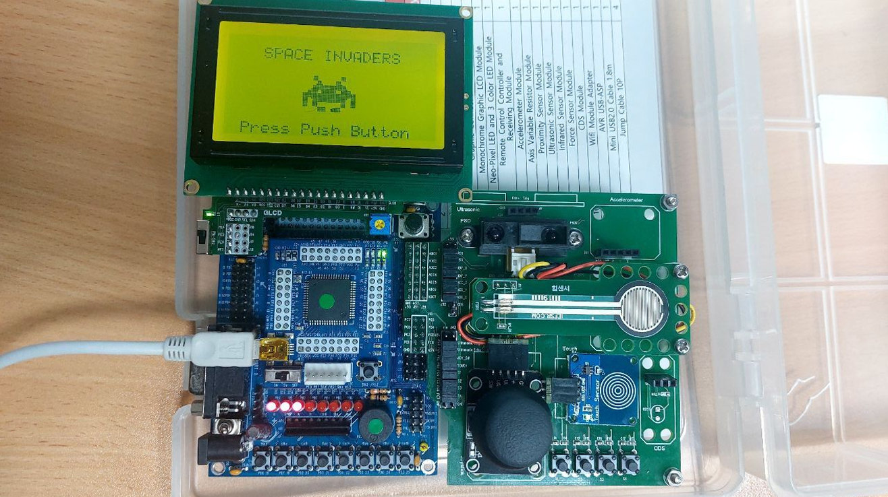
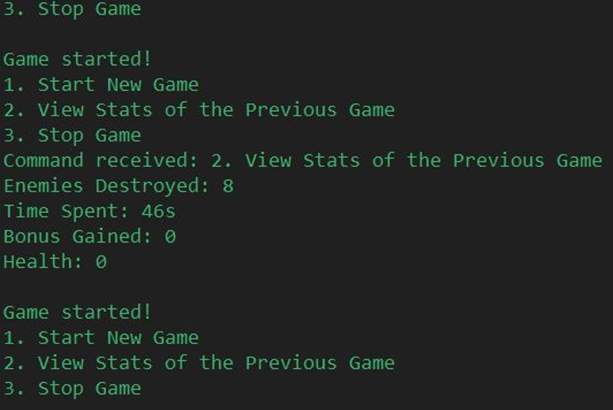
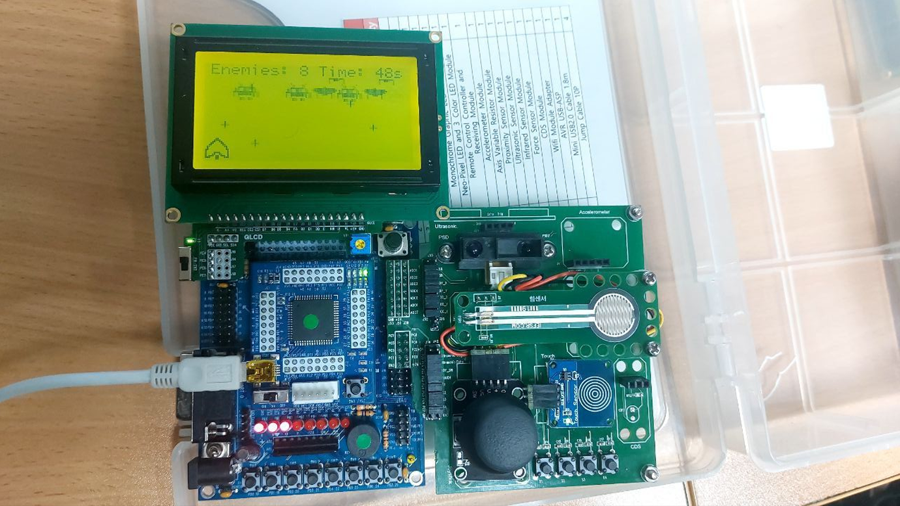
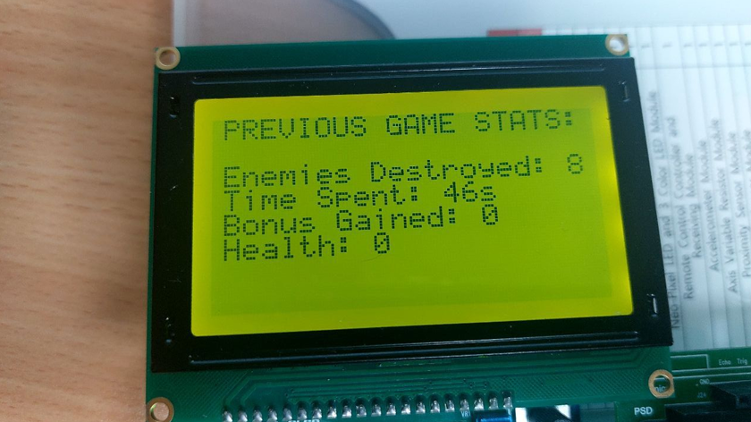

# Space Invaders on Atmega128

This repository contains the source code for a **Space Invaders** game implemented for the **Atmega128** microcontroller. The game includes features like dynamic rendering of aliens, stars, and UFOs, shooting mechanics, and player stats persistence in EEPROM.

## Features

- Dynamic rendering of spaceship, enemies, and stars.
- Bonus star system with health regeneration.
- Persistent storage for game stats (enemies destroyed, time spent, bonus stars collected, spaceship health).
- Interactive gameplay with joystick input and button presses.
- Real-time updates for remaining enemies, time, and player health displayed via LEDs and LCD.

## Requirements

- **Hardware**: Atmega128 microcontroller, joystick, push button of joystick, LCD, LEDs, PCD sensor
- **Software**:
  - Atmel Studio installed for building the project.
  - `avrdude` installed for flashing the microcontroller.
  - Optional: **VS Code** for development (setup guide below).

## Setup Instructions

1. **Clone this repository**:
   ```bash
   git clone https://github.com/JohnnyKoshev/space-invaders.git
   cd space-invaders
   ```

2. **Add necessary paths to `User Path` environment variable on Windows machine**:
   - Path to **Atmel Studio** executables (e.g., `C:\Program Files (x86)\Atmel\Studio\7.0`).
   - Path to **avrdude** (e.g., `C:\Program Files (x86)\AVRDUDESS`).

3. **Build and flash the project**:
   - Use the provided `build_and_flash.ps1` script:
     ```powershell
     ./build_and_flash.ps1
     ```
   - The script compiles the project and flashes it to the Atmega128 microcontroller.

4. **Run the game**:
   - Connect the joystick and LCD to the Atmega128 board.
   - Power on the device and connect via COM port to your PC to start the game.

## Optional: Set Up Visual Studio Code for Development

If you prefer using **VS Code** for development, follow this tutorial to set up your environment:  
[Setting up Visual Studio Code for AVR Programming](https://izzudinhafizprojects.wordpress.com/2021/04/05/setting-up-visual-studio-code-vscode-for-avr-programming-not-arduino/).

This setup will allow you to develop, build, and debug the project efficiently in VS Code.

## Gameplay Commands via Serial Communication (UART1)

- **1**: Start a new game.
- **2**: View stats from the previous game.
- **3**: Quit the current game.

## Images and Visuals

Below are some visuals to help you understand the game setup and features.

### 1. Main Features Overview
  
*Illustration of the main page.*

### 2. Serial Communication Setup
  
*Showcasing the sample serial communication process between the Atmega128 microcontroller and PC.*

### 3. Game in Action
  
*Example of the game running with all components connected, including joystick and LCD.*

### 4. Player Stats Display
  
*Visual representation of player stats displayed.*

## Contributing

Contributions, bug reports, and feature requests are welcome! Feel free to open an issue or submit a pull request.

---

Enjoy playing **Space Invaders** on your Atmega128! 🎮

---
